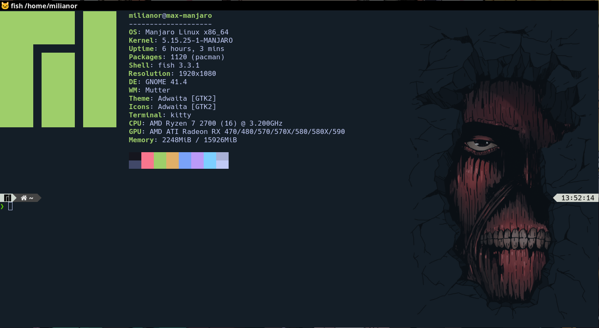

# Linux and Windows Configuration
### by *Max Miliano Del Canto*

## Neovim config
[milianor-vim](https://github.com/maxmx03/milianor-vim)

## Linux configs
- [Tmux](https://linuxize.com/post/getting-started-with-tmux/)
- [Tmux plugin manager](https://github.com/tmux-plugins/tpm)
- [Fish](https://fishshell.com/)

## Windows configs
- [Powershell 7](https://docs.microsoft.com/en-us/powershell/scripting/install/installing-powershell-on-windows?view=powershell-7.2)

## PowerShell modules
- [oh-my-posh](https://ohmyposh.dev/docs/windows)
- [posh-git](https://github.com/dahlbyk/posh-git)
- [PSReadLine](https://github.com/PowerShell/PSReadLine)
- [Fzf](https://github.com/junegunn/fzf)
- [PSFzf](https://github.com/kelleyma49/PSFzf)
- [z](https://www.powershellgallery.com/packages/z/1.1.13)

## Fonts
- [Nerd Fonts](https://www.nerdfonts.com/)
### Fonts recommendations
1. FiraCode Nerd Font
2. Sauce Code Pro Nerd Font
3. Hack Nerd Font
4. VictorMono Nerd Font

## Themes/Colors - Tokyo Night
- [Fish](https://github.com/folke/tokyonight.nvim)
- [Windows Terminal](https://windowsterminalthemes.dev/)

## Recommended Tutorials
1. [Neovim](https://www.youtube.com/watch?v=FW2X1CXrU1w)
2. [Fish](https://www.youtube.com/watch?v=KKxhf50FIPI&t=873s)
3. [PowerShell](https://www.youtube.com/watch?v=5-aK2_WwrmM&t=384s)
